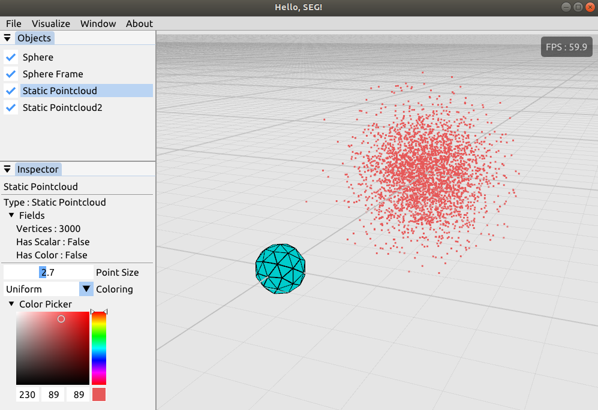

## SEG : Slam Easy Gui




 [ SEG : SLAM Easy Gui ] is designed to be a beginner-friendly GUI tool. SEG aims to wrap all rendering needs for SLAM researchers, with minimum effort. For those who are unfamilliar with OpenGL, SEG wrapped its all rendering APIs inside. What you need to do is just a single line call, and SEG will do the job for you!

```c++
seg::initialize("my_window",seg::WindowSize(1000,600));
```

 Adding object is also very easy.

```c++
seg::addObject(seg::Object::Axis());
```

For more details, check SEG/examples.


### How To Build


### Getting Started


### Note

**Formatting**

SEG uses Clang formatter, based on Google Format, but with slight modifications.

- IndentWidth: 4

- BreakBeforeBraces: BS_Mozilla


### TODOs
