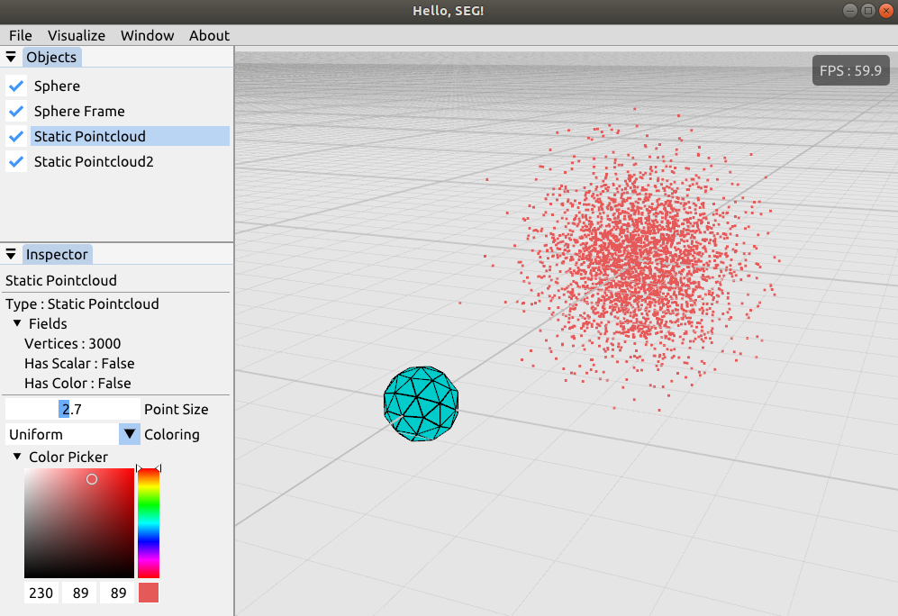

## SEG : Slam Easy Gui




 [ SEG : SLAM Easy Gui ] is designed to be a beginner-friendly GUI tool. SEG aims to wrap all rendering needs for SLAM researchers, with minimum effort. For those who are unfamilliar with OpenGL, SEG wrapped its all rendering APIs inside. What you need to do is just a single line call, and SEG will do the job for you!

```c++
seg::initialize("my_window",seg::WindowSize(1000,600));
```

 Adding object is also very easy.

```c++
seg::addObject(seg::Object::Axis());
```

For more details, check SEG/examples.


### How To Build

**Dependencies**

- CMake 3.14+
- C++17 compiler
- OpenGL, GLFW3, GLEW
- OpenCV (optional, enabled by default)

On macOS:
```bash
brew install glfw glew opencv
```

On Ubuntu/Debian:
```bash
sudo apt install libglfw3-dev libglew-dev libopencv-dev
```

**Build**

```bash
git clone --recursive <repo-url>
cd seg
mkdir build && cd build
cmake ..
make -j
```

To build without OpenCV:
```bash
cmake .. -DUSE_OPENCV=OFF
```

If you cloned without `--recursive`, initialize submodules first:
```bash
git submodule update --init --recursive
```


### Getting Started

SEG runs its rendering loop separately from your application logic. The threading behavior is controlled by `ThreadPolicy` in `seg::Options`.

**`OWN_THREAD`** (default on Linux) — `seg::initialize()` spawns a rendering thread and returns immediately. Your code continues on the main thread.

```c++
#include "seg/seg"

int main() {
  seg::initialize("my_window", seg::WindowSize(1000, 600));

  // SEG is already running in the background.
  seg::addObject(seg::Object::Axis());

  // Objects can be added at any time from any thread.
  seg::waitUntilClosed();
  return 0;
}
```

**`MAIN_THREAD`** (default on macOS) — `seg::initialize()` performs setup only. Call `seg::run()` to start the rendering loop on the main thread (blocking).

```c++
#include "seg/seg"

int main() {
  seg::initialize("my_window", seg::WindowSize(1000, 600));

  // Add objects before run() — the rendering loop hasn't started yet.
  seg::addObject(seg::Object::Axis());

  seg::run();  // Blocks until window is closed.
  return 0;
}
```

macOS requires `MAIN_THREAD` because Cocoa restricts window and event handling to the main thread.

For more details, see `examples/`.

### Note

**Formatting**

SEG uses clang-format with Google style. See `.clang-format`.


### TODOs

- [x] Shutdown segfault fix: glfwTerminate omitted (WSL2 mesa TLS cleanup crash)
- [x] Shutdown guard: API calls after window close gracefully ignored (shut_down flag in ObjectManager)
- [x] Embed default font as header (Roboto Regular, compressed in `seg/resources/roboto_regular.h`)
- [ ] Wide line rendering: `glLineWidth` >1.0 unsupported on core profile. Need geometry shader or quad-based line
- [ ] Grid renderer → infinite grid shader (replace vertex-based LOD grid with fragment shader approach)
- [x] ~~Test `glfwMakeContextCurrent(NULL)` before shutdown~~ — tested, still segfaults on WSL2. No workaround available.
- [ ] Line/Pointcloud renderer deduplication (F6)
- [ ] Shader API consistency: some renderers use raw uniform strings instead of helpers (F7)
- [ ] `install()` target and interface library for downstream consumers
